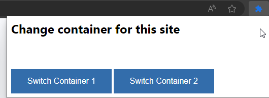

# Multi-account Container POC for Edge/Chrome
This is a small POC for multi-account containers in Edge or Chrome. The only thing this currently does is, whenever the Container X button is clicked:

- Check if Container X is different than CurrentContainer
- If not different, do nothing
- If different, get the value of all cookies belonging to the current tab
- Save the value of those cookies and the current URL to localstorage
- Clear all cookies for the tab
- Get the saved cookies and URL for Container X
- Set the cookies for the current tab
- Visit the saved URL

This is a VERY basic POC, and it will break other things. It does not entirely respect what cookies belong to the current tab. It might delete all cookies globally. It might expose cookies to access by other sites. Do not use it near a browser used for anything important. Do not use it on a machine used for anything important. Do not use it on a network used for anything important. Do not use it on a planet used for anything important.

## How to use
Don't. But if you must:
- Clone this repo
- Open Edge or Chrome
- Go to `edge://extensions/` or `chrome://extensions/`
- Enable Developer Mode
- Click "Load Unpacked"
- Select the folder where you cloned this repo
- Click the extension icon
- You will see two buttons, one for Container 1 and one for Container 2.
- Go to a TEST SITE and log in
- Click the "Container 2" button. The cookies and current URL for Container 1 will be saved to localStorage and then cleared.
- Log in with another account
- Click the "Container 1" button. The cookies will be retrieved from localStorage and set for the current tab. The URL will be set to the saved URL.

